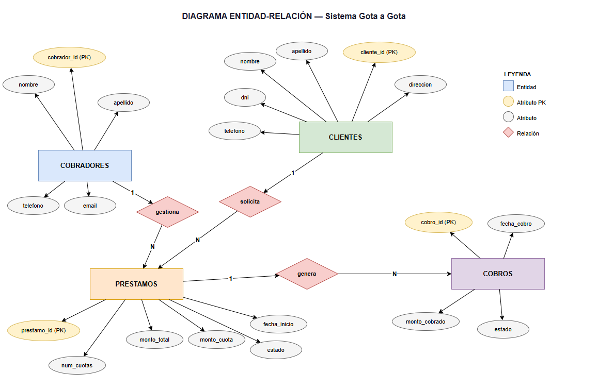
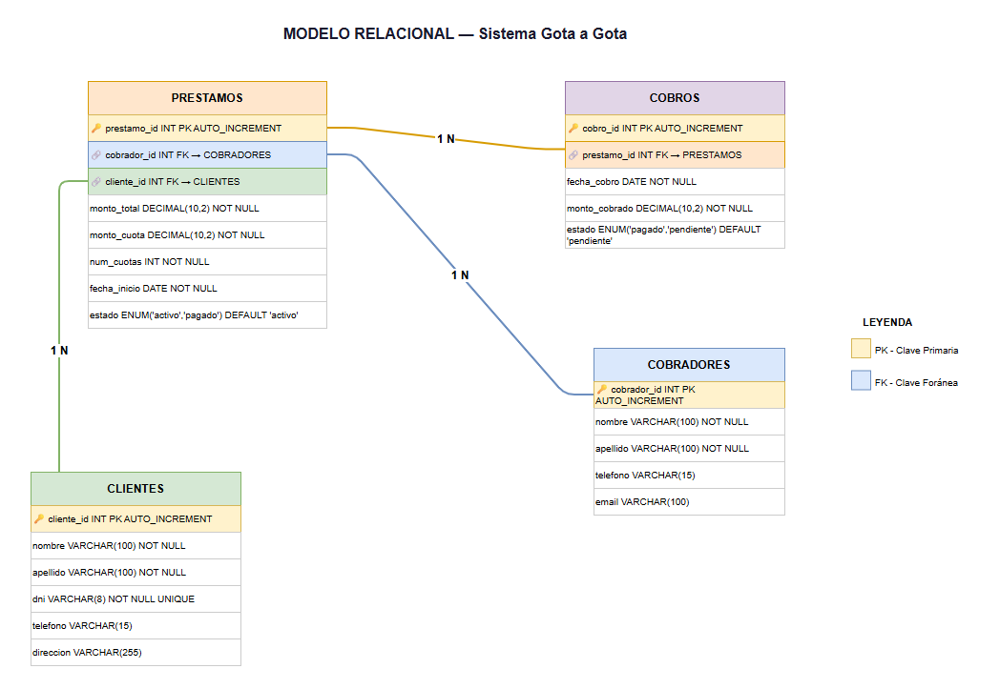

# Sistema de Préstamos Gota a Gota
Sistema web para la gestión de préstamos a crédito con facilidades de pago diario, semanal y mensual. Desarrollado como proyecto final del curso de Java Web en SENATI.

## Descripcion del negocio
Nombre: Prestamos Gota a Gota  
Giro: Financiera informal de creditos personales  
Tamaño: Pequeña empresa, operacion individual o familiar  
Contexto: Negocio muy comun en el Peru donde un cobrador otorga prestamos pequeños a personas que no acceden a bancos, cobrando cuotas diarias, semanales o mensuales visitando al cliente en su domicilio o trabajo.  
Justificacion: Se necesita un sistema digital para reemplazar el cuaderno manual del cobrador, evitar errores y tener un control claro de cada prestamo y cobro.

## Identificar el problema y solución
Problema: El cobrador lleva el registro de prestamos y cobros en un cuaderno o en papel, lo que genera errores, perdida de informacion, dificultad para saber cuanto debe cada cliente y cuantas cuotas faltan.  
Solucion tecnologica: Desarrollar un sistema web con Java Spring Boot y MySQL que permita registrar clientes, prestamos y cobros diarios, mostrando en todo momento el estado de cada prestamo y el historial de pagos.

 
## Requerimientos Funcionales
| Codigo | Descripcion |
|---|---|
| RF01 | El sistema debe permitir registrar un nuevo cliente con nombre, apellido, DNI, telefono y direccion |
| RF02 | El sistema debe permitir registrar un nuevo prestamo indicando monto total, cuota, numero de cuotas y fecha de inicio |
| RF03 | El sistema debe permitir registrar el cobro diario de un cliente asociado a su prestamo |
| RF04 | El sistema debe mostrar el listado de todos los clientes con su estado de deuda |
| RF05 | El sistema debe mostrar el historial de cobros realizados por prestamo |
 
## Requerimientos No Funcionales
 
| Codigo | Tipo | Descripcion |
|---|---|---|
| RNF01 | Rendimiento | El sistema debe cargar cada pantalla en menos de 3 segundos |
| RNF02 | Usabilidad | La interfaz debe ser intuitiva y facil de usar sin necesidad de capacitacion previa |
| RNF03 | Seguridad | Solo usuarios autorizados podran acceder al sistema mediante usuario y contraseña |
## Stack completo
1. Trello             = Gestión del proyecto (Kanban)
2. Draw.io            = Diagrama ER + Diagrama de Clases
3. Figma              = Wireframe + Diseño UI/UX
4. MySQL Workbench    = Diseñar y administrar BD
5. IntelliJ           = Frontend (HTML,CSS,JS) + Backend (Spring Boot)
6. XAMPP              = Servidor Tomcat para correr la app

## Tecnologias utilizadas
- Java 17
- Spring Boot 3
- MySQL 8
- HTML5, CSS3, JavaScript
- IntelliJ IDEA
- XAMPP (Tomcat)
- MySQL Workbench
- Figma (diseño UI/UX)
- Draw.io (diagramas)

## Base de datos
 
El sistema cuenta con 4 tablas principales:
 
| Tabla | Descripcion |
|---|---|
| COBRADOR | Personas encargadas de gestionar y cobrar los prestamos |
| CLIENTE | Personas que solicitan el prestamo |
| PRESTAMO | Registro de cada prestamo otorgado |
| COBRO | Registro de cada pago diario realizado |

  
### Diagrama Entidad-Relacion (DER)

 
### Modelo Relacional (MR)

 
